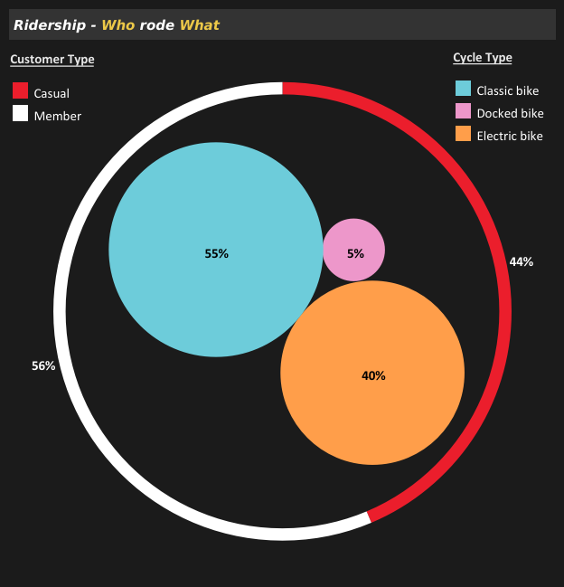
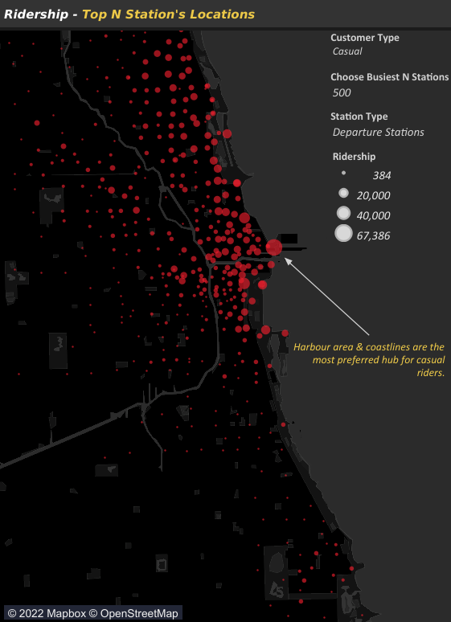
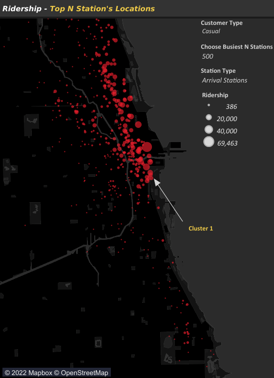
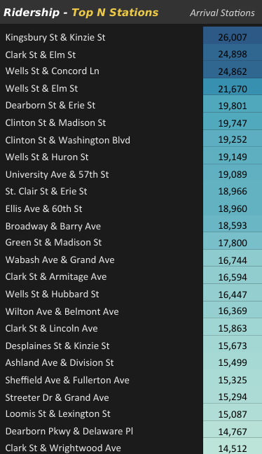

# **CYCLISTIC PROJECT**
     

# Table of contents
* [**Project Set-up**](#project-set-up)  
  * [Introduction](#introduction)  
  * [Scenario](#scenario)  
  * [Problem Statement](#problem-statement)  
  *  [Goals & Deliverables](#goals--deliverables)  
*  [**Data pre-processing**](#data-pre-processing)  
   *  [Data Collection](#data-collection)  
   *  [Data Import](#data-import)  
   *  [Data Quality Analysis](#data-quality-analysis)  
   *  [Data Cleaning & Transformation](#data-cleaning--transformation)  
   *  [Exploratory Data Insights](#exploratory-data-insights)  
*  [**Data Processing**](#data-processing)  
   *  [Data Processing Steps](#data-processing-steps)  
      *   [Calculations](#calculations)  
*   [**Data Analysis**](#data-analysis)  
    *   [BAN: Insights](#ban-insights)  
    *   [Time: Insights](#time-insights)  
        *   [Monthly Trends](#monthly-trends)  
        *    [Weekly Trends](#weekly-trends)  
        *    [Hourly Trends](#hourly-trends)  
    *    [Maps: Insights](#maps-insights)  
         *    [All Stations](#all-stations)  
         *    [Top 500 Departure Stations](#top-500-departure-stations)  
         *    [Top 500 Arrival Stations](#top-500-arrival-stations)  
         *    [Top 25 Stations](#top-25-stations)  
         *    [Top 25 Departure Stations](#top-25-departure-stations)  
         *    [Top 25 Arrival Stations](#top-25-arrival-stations)  
         *    [Spider Maps: All Stations](#spider-maps-all-stations)  
         *    [Spider Maps: Busiest Stations](#spider-maps-busiest-stations)
*  [Summarization](#summarization)
*  [Caveats & Limitations](#caveats--limitations)
*  [Recommendations](#dashboards)
*  [Dashboards](#dashboards)
*  [Conclusion](#conclusion)

# **Project Set-up**
## **Introduction**
Hi! Welcome to the cyclistic case-study. This is a data analysis capstone project and was completed as part of the Google Data Analytics Certification. The period of the analyzed data is from June'2021 - May'2022.
 * There are multiple possible approaches with different tools/languages for analyzing this data. SQL, R, Python, Spreadsheets, Tableau, PowerBI all can do this analysis effectively on standalone basis or in combination with each other.  Since, the volume of data is high, combination of SQL and Tableau/PowerBI is recommended for beginners. For experienced users, any tool will suffice with optimizations but combination of SQL can be most efficient in large data cleanup, R, on the other hand can deliver end to end project by itself without the need of any external data migration. So feel free to choose your preferred tool. I specifically used combination of PowerBI, DAX Studio and Tableau in combination to showcase the BI tools. Under the work environment, for the same kind of data, I would have preferred SQL in combination with BI Tools due to its efficiency and faster execution.

## **Scenario**
We are data analysts working in the marketing analyst team at *Cyclistic*, a bike-share company in *Chicago*. *Lily Mareno, the director of marketing* believes the company’s future success depends on maximizing the number of annual memberships. Therefore, your team wants to understand how casual riders and annual members use Cyclistic bikes differently. From these insights, your team will design a new marketing strategy to convert casual riders into annual members. But first, Cyclistic executives must approve your recommendations, so they must be backed up with compelling data insights and professional data visualizations.  

## **Problem Statement**
In 2016, *Cyclistic* launched a successful bike-share offering. Since then, the program has grown to a fleet of *5,824* bicycles that are geo-tracked and locked into a network of *692* stations across *Chicago*. The bikes can be unlocked from one station and returned to any other station in the system anytime.

Cyclistic sets itself apart by also offering reclining bikes, hand tricycles, and cargo bikes, making bike-share more inclusive to people with disabilities and riders who can’t use a standard two-wheeled bike. The majority of riders opt for traditional bikes; about 8% of riders use the assistive options. Cyclistic users are more likely to ride for leisure, but about 30% use them to commute to work each day.  

Until now, Cyclistic’s marketing strategy relied on building general awareness and appealing to broad consumer segments. One approach that helped make these things possible was the flexibility of its pricing plans: single-ride passes, full-day passes, and annual memberships. Customers who purchase single-ride or full-day passes are referred to as casual riders. Customers who purchase annual memberships are Cyclistic members.  

Cyclistic’s finance analysts have concluded that annual members are much more profitable than casual riders. Although the pricing flexibility helps Cyclistic attract more customers, Moreno believes that maximizing the number of annual members will be key to future growth. Rather than creating a marketing campaign that targets all-new customers, Moreno believes there is a very good chance to convert casual riders into members. She notes that casual riders are already aware of the Cyclistic program and have chosen Cyclistic for their mobility needs.  

*Moreno* has set a clear *goal: Design marketing strategies aimed at converting casual riders into annual members.* In order to do that, however, the marketing analyst team needs to better understand *how annual members and casual riders differ*, *why casual riders would buy a membership*, and *how digital media could affect their marketing tactics*. Moreno and her team are interested in analyzing the Cyclistic historical bike trip data to identify trends.  

## **Goals & Deliverables**
* Find out the differentiation in usage patterns of annual members and casual riders.
* Find out the appropriate incentives or reasons for converting casual riders into annual members.
* Find out the effective digital media strategy to influence casual members to become members.

# **Data Pre-processing**
This section is divided into 5 sub-headings. Starting with the raw data collection then importing and collating all the data to the desired tool. Once data is collated then verifying the quality of data and how much pre-processing it would need to be usable, if at all. After that based on our observations & EDA(exploratory data analysis), we clean and pre-process the data. Once it is deemed satisfactory enough for non-skewed insights based on our EDA, then we will extract exploratory data insights from the pre-processed data.

## **Data Collection**
* We will use Cyclistic’s historical trip data to analyze and identify trends. Download data source zip/csv files from [**here**](https://divvy-tripdata.s3.amazonaws.com/index.html).

## **Data Import**
 Imported the source data after unzipping the files. Total 12 source files will be generated for each month.  

    = Csv.Document(File.Contents("D:\Study\Projects\Google Data Analytics\Case-study_1_cyclist\PowerBI\12_Months_Cyclist_Dataset\Source_CSV\202106-divvy-tripdata.csv"), [Delimiter=",", Columns=13, Encoding=1252, QuoteStyle=QuoteStyle.None])

## **Data Quality Analysis**
* **Data Source**: The data has been made available by Motivate International Inc. under this [**license**](https://ride.divvybikes.com/data-license-agreement). This is public data that we can use to explore how different customer types are using Cyclistic bikes.
* **Data Validity**: Cyclistic is a fictional company, hence, for the purposes of this case study, the datasets are appropriate and will enable you to answer the relevant business questions. We will proceed with analysis with the latest data at the time of analysis. We will use the last 12 months of historical data from *June'2021 - May'2022*.
* **Data Constraints**: Data-privacy issues prohibit you from using riders’ personally identifiable information. This means that you won’t be able to connect pass purchases to credit card numbers to determine if casual riders live in the Cyclistic service area or if they have purchased multiple single passes.
* **Data Structure**: There are *13* columns and *58,60,776* records for the entire dataset. Some of the month's dataset is missing headers.
* **Missing Values**: Columns featuring location attributes like *start_station_name, start_station_id, end_lat, end_log etc.* have considerable missing values. 
* **Duplicate Data**: No Data Duplication was observed for any of the columns.
* **Inconsistent data**: Inconsistency was observed with few of the station names with respect to station_id as well as outliers for ride duration column.

## **Data Cleaning & Transformation**
* Promoted Headers wherever the Headers were not defined in the source files.
  
      = Table.PromoteHeaders(Source, [PromoteAllScalars=true])

* Merged all the 12 processed csv files into a single csv for analysis.

      = Table.Combine({#"202106-divvy-tripdata", #"202107-divvy-tripdata", #"202108-divvy-tripdata", #"202109-divvy-tripdata", #"202110-divvy-tripdata", #"202111-divvy-tripdata", #"202112-divvy-tripdata", #"202201-divvy-tripdata", #"202202-divvy-tripdata", #"202203-divvy-tripdata", #"202204-divvy-tripdata", #"202205-divvy-tripdata"})  

* Removed ride_id column from the dataset since it won't be needed in any form in our analysis.  

      = Table.RemoveColumns(#"Changed Type",{"Source.Name", "ride_id"})  

* Changed the data type of columns appropriately.  

      = Table.TransformColumnTypes(#"Expanded Table Column1",{{"Source.Name", type text}, {"ride_id", type text}, {"rideable_type", type text}, {"started_at", type datetime}, {"ended_at", type datetime}, {"start_station_name", type text}, {"start_station_id", type text}, {"end_station_name", type text}, {"end_station_id", type text}, {"start_lat", type number}, {"start_lng", type number}, {"end_lat", type number}, {"end_lng", type number}, {"member_casual", type text}})  

* Few of missing values where station id was present but station name was missing which was filled with corresponding station name wrt to station id. For eg: *Hegewisch Metra Station* station_name for station_id *20215*.

  
</left>  

  

* Renamed all the columns as per convenience.

      = Table.RenameColumns(#"Removed Columns",{{"rideable_type", "CycleType"}, {"started_at", "Departed At"}, {"ended_at", "Arrived At"}, {"start_station_name", "Departure Station"}, {"start_station_id", "Departure Station ID"}, {"end_station_name", "Arrival Station"}, {"end_station_id", "Arrival Station ID"}, {"start_lat", "Departure Lat"}, {"start_lng", "Departure Lng"}, {"end_lat", "Arrival Lat"}, {"end_lng", "Arrival Lng"}, {"member_casual", "Customer Type"}})

* Created  new custom/calculated columns *"Trip Duration", "Quarter", "Month", "Trip Weekday"*.

      = Table.AddColumn(#"Renamed Columns", "Trip Duration", each [Arrived At]-[Departed At])
      = Table.AddColumn(#"Added Custom", "Quarter", each Date.QuarterOfYear([Departed At]), Int64.Type)
      = Table.AddColumn(#"Inserted Quarter", "Month", each Date.MonthName([Departed At]), type text)
      = Table.AddColumn(#"Inserted Month Name", "Trip Weekday", each Date.DayOfWeekName([Departed At]), type text)

* Changed data type of *Trip Duration* column to dd.hh.mm.ss duration format.  

      = Table.TransformColumnTypes(#"Added Custom",{{"Trip Duration", type duration}})
 
* Filtered values which are less than or equal to 1 second for *trip duration* column.  

      = Table.SelectRows(#"Inserted Day Name", each [Trip Duration] >= #duration(0, 0, 0, 1))  

* Rounded of all the location coordinates column to 5 digits.

      = Table.TransformColumns(#"Filtered Rows",{{"Departure Lat", each Number.Round(_, 5), type number}, {"Departure Lng", each Number.Round(_, 5), type number}, {"Arrival Lat", each Number.Round(_, 5), type number}, {"Arrival Lng", each Number.Round(_, 5), type number}})  

* Added a new calculated "*Total Trip Duration Min*" column by extracting minutes form  "*Trip Duration*" column.  

      Total Trip Duration Min = DATEDIFF([Departed At], [Arrived At],  MINUTE)  

## **Exploratory Data Insights**

* NA/Missing values are  present in station name and id. For eg: *start_station_name* have *8,23,167* number of records as missing values/NA. They account for more than 14% of the data. Removing such a large no of outlier may skew the result and we may miss an important insight. Rather than Filtering the NA values from dataset. Dynamic filter shall be applied wherever the location insights are to be analyzed.  

* *Trip duration* column values are inconsistent for many of the observations where values are as low as 0 seconds or as high as 38 days. "*Trip_duration*" column was filtered for values less than or equal to 1 second since no journey can be less than 1 sec and the numbers of records for such rides is negligible, hence, no skewing of insights for other columns shall be observed.
* Values for *Total Trip Duration Min* is varying from as low as 0 minutes to as high as 50000 minutes. Considering the max duration validity for a casuals pass is 1 day we don't have any other prior info, hence, we will treat ride duration greater than 1400 minutes and less than 1 minute as outliers.  
* Outliers of *Total Trip Duration Min* will be filtered dynamically during calculations and the calculated values of filtered observations will be compared with non-filtered observations to analyze the effect of filters and for any relevant insights.
* Longitude and latitude values are varying to different precision and values for the same station id. Either we can group the latitude and longitude values by station id and take the mean value for each station id group and populate the missing rows for latitude and longitudinal values at this step or we can do the same with location and map insights during analysis. I have preferred the later approach for better flexibility  in my analysis.  
* Rounded of the latitude and longitude values to 5 digits. 5 digits resolution value is accurate enough for our analysis purposes.  

# **Data Processing**
This section covers the data processing steps and calculations of the respective steps wherever required. We derive BAN(big aggregate numbers) and all the relevant calculations deemed necessary for our analysis as per our EDA insights.
## **Data processing steps**

* Created Data Source filter of customer type
* Used customer type filter as context filter
* Calculated total no of records, mean trip duration, median, mode and std. deviations for non-filtered values of *Total trip Duration Min*  
* Calculated total no of records, mean trip duration, median, mode and std. deviations for filtered values of *Total trip Duration Min*
* Compared and analyzed the filtered and non-filtered values of *Total trip Duration Min* 
* Analyzed Customer Type Usage pattern  
* Analyzed Cycle Type usage pattern
* Analyzed Hourly usage pattern by customer type
* Analyzed Weekly usage pattern by customer type
* Analyzed annual usage pattern by customer type
* Created two parameters: "*Station Type*" & "*Busiest N stations*"
* Created a "*station set*" filtering out null values for Stations

### _**Calculations**_
    Mean = AVERAGE(Append1[Total Trip Duration Min])
    Median = MEDIAN(Append1[Total Trip Duration Min])
    Mode = MINX(TOPN(1,ADDCOLUMNS(VALUES(Append1[Total Trip Duration Min]),"frequency",CALCULATE(COUNT(Append1[Total Trip Duration Min]))), [frequency], DESC), Append1[Median])
        
    Mean Filtered = CALCULATE(AVERAGE(Append1[Total Trip Duration Min]), Append1[Total Trip Duration Min] >=1 && Append1[Total Trip Duration Min] <= 1440)
    Median Filtered = CALCULATE(MEDIAN(Append1[Total Trip Duration Min]), Append1[Total Trip Duration Min] >=1 && Append1[Total Trip Duration Min] <= 1440)
    Mode Filtered = MINX(TOPN(1,ADDCOLUMNS(VALUES(Append1[Total Trip Duration Min]),"frequency",CALCULATE(COUNT(Append1[Total Trip Duration Min]), Append1[Total Trip Duration Min] >=1 && Append1[Total Trip Duration Min] <= 1440)), [frequency], DESC),  Append1[Median])

    Total Records = COUNT([cyclist_Jun21_May22.csv])  
    Mean Trip Duration = AVG([Total Trip Duration Min])
    Median Trip Duration = MEDIAN([Total Trip Duration Min])
    Mode Frequency = {FIXED:MAX({FIXED[Total Trip Duration Min Dim]:COUNT([cyclist_Jun21_May22.csv])})}  
    Mode Identifier = IF {FIXED [Total Trip Duration Min Dim]:COUNT([cyclist_Jun21_May22.csv])} = [Mode Frequency] THEN TRUE else FALSE END  

# **Data Analysis** 
This section covers all the relevant analysis and trends deemed necessary for our goals. This section can be majorly be divided into 3 parts: BAN-based analysis, Time-based analysis and Map-based analysis.

## **BAN: Insights**
In this section, we analyze the calculated BAN(big aggregate numbers) insights and trends. After cleaning the data, total no. of rides is around 6 Million.

  
</left> 

 

  

  

> Img Desc: Pie chart visualizing the ridership by customer type and cycle type for all, casual and member customers respectively. All the legends represented above will be followed throughout this project for all visualizations.

* Majority(*55%*) of our existing customers are already members. Overall, classic and electric bikes are preferred bike types with classic being the top choice.
* Member customers exclusively use classic and electric bikes only, indicating that cycling may be is part of the daily routine for members, hence avoiding the hassle of docking stations and taking end to end rides.
* *11%* of casual customers use docked bikes indicating that these customers can be tourists, non-locals or non-sticky customers.
* Low usage of docked bikes can be due to 2 reasons either due to low ease of usage and convenience compared to other bikes or number of docked bikes is inherently low as prt of whole and hence being represented proportionally in ride-share. Since, no further data regarding bike types are available with us nothing can be said conclusively.
---
* For non-filtered ***Total Trip Duration Min*** column:

  | Calculated Column       |Customer Type     |   Mean  | Median |  Mode  | Std. deviation |
  |-------------------------|------------------|---------|--------|--------|----------------|
  | Total Trip Duration Min |  All             | 20.7    |   11   |   6    | 164.8          |
  | Total Trip Duration Min | Member           | 13.1    |   9    |   5    | 27.3           | 
  | Total Trip Duration Min | Casual           |  30.6   |   15   |   8    | 247            |

    * Analyzing the Mean, Median, Mode for "*Total Trip Duration Min*", we observe that Mean > Median > Mode which confirms our exploratory observations regarding considerable presence of outliers and reveals that dataset is positively skewed.
    * Upon calculating the aggregate values by customers type, we see further difference b/w the ride pattern of both customer types. Casual customers usually prefer much longer trip than the member customers.  
    * Std. deviation is unusually high for casual customers indicating either of the three possibilities i.e. significant presence of outliers in casual customers with higher magnitude compared to member customers or non-uniformity of the riding behavior of casual customers or perhaps the combination of both.  

* For filtered ***Total Trip Duration Min*** column:  
  | Calculated Column       |Customer Type     |   Mean  | Median |  Mode  | Std. deviation |
  |-------------------------|------------------|---------|--------|--------|----------------|
  | Total Trip Duration Min |  All             | 18.53   |   11   |   6    | 34.09          |
  | Total Trip Duration Min | Member           | 12.94   |   9    |   5    | 19.73          | 
  | Total Trip Duration Min | Casual           | 25.72   |   15   |   8    | 45.46          |

    * After filtering the outliers (1 <= Total Trip Duration Min <= 1440), dataset is still positively skewed albeit to a lesser extent.
    * Aggregate values for casual customers provides the same insights as before for ride patterns. But, magnitude of mean values for casual customers reduces much more in comparison to member customers further confirming our hypothesis regarding the significant presence of outliers for casual customers.
    * Std. deviation decreases in magnitude for both type of customers but reduction in magnitude is exponential for casual customers( *45 mins vis-a-vis 247 mins previously*) owing to the greater number and magnitude of outliers for casual customers.  

* Filtered Vs Non-filtered
  * Comparing the filtered and non-filtered values clearly points out to presence of outliers/wrong data points especially for casual customers.
  * Owing to presence of outliers, all median values will be considered for aggregate avg. values for filtered values.
    * Avg. Trip Duration in Min for all customers is around 11 minutes with a std. deviation of around 34 minutes.
    *  Avg. Trip Duration in Min for member customers is around 9 minutes with a std. deviation of around 20 minutes.
    *  Avg. Trip Duration in Min for casual customers is around 15 minutes with a std. deviation of around 45 minutes.
---
## **Time: Insights**
In this section, we analyze all the trends and insights observed for the different periods of time. Section goes further granular in analysis as we move ahead; starting from monthly trends over a period of an year to hourly trends.

### **Monthly Trends**
 
  
</left>

 

> Img Desc: Dual-axis graph where area under unstacked graph is representing ridership for each month by customer type, while, line graph represents avg. trip duration per month by customer type. 

* Ridership starts increasing up from the bottomed out month of January till July and again starts decreasing from the month of August till January. In other words, July is the peak month of year while January is the bottom month in terms of total ridership. 
* May, June, July, August & September are the busiest months of year in terms of total ridership.
* Overall, we can observe a high corelation between the seasons and ridership indicating the recurring seasonal cycle upon which the ridership is dependent. 
* Busiest months overlaps with summer months and are preferred time of the year for rides, while, riderships falls sharply as the temperature dips.
* Avg. duration of ridership remains comparatively stable for member customers all round the year while ride duration for the casual customers deviates much more sharply and shows a comparative sharper decline or increase for the same durations.
* As observed earlier with ride duration trends, same pattern is observed for ridership over months. No. of rides for casual members falls much more sharply in winter months and rises more rapidly when compared with members for the same duration of time, indicating a much more consistency in regular usage and engagement by member customers.
* Ridership fall by 96% for casual customers to its bottomed out month of January from its peak month of July, while, for member customers it falls by 78% from its peak month i.e. September to its bottomed out month i.e January.

### **Weekly Trends**
 
  
</left>

 

> Img Desc: Dual-axis graph where stacked bar graph is representing ridership for each weekday by customer type, while, line graph represents avg. trip duration per weekday by customer type. 

* Overall, ridership increases on weekends with Saturday being the busiest day in terms of riderships. But, Casual and member customers exhibit inverse trends over preferred days for rides.
* Casual customer's ridership peaks during weekends and decreases further as we move away from weekends. Casual customers are the primary contributors for the sharp uptick in ridership but ridership also falls sharply on weekdays.
* Member customer's ridership trend is in complete contrast of casual customers. Further we move away from weekends, more the ridership increases indicating the usage of cycles as part of daily routine by member customers.
* Avg. Trip duration in minutes increases for both types of customers on weekends *insights*  indicating that these types of rides can be outstation trips or leisure rides hence not bound by the daily routine.

### **Hourly Trends**
 
  
</left>

> Img Desc: Line graph represents ridership for each hour by customer type.

* Overall, usage bottoms out at 4'o clock and steadily keeps increasing till 8'o clock. Though it declines during the next hour but steadily keeps increasing till it peaks at 17'o clock and declining thereafter till 4'o clock.
* Member customers usage peaks at 8'o clock & 17'o clock respectively coinciding with the working hours indicating the usage as part of daily routine.
* Casual customers usage keeps on increasing as the day progresses peaking at 17'o clock.
* Usage falls for both customers after 17'o clock(evening hours) indicating that usage may be preferred only during sunlight hours.
-------------

## **Maps: Insights**
This section covers the map based insights. As we move ahead in this section, we increase the granularity of our analysis where we start with all the stations and end with the busiest stations for each customer type. All the maps are composed of at most 3 layers i.e stations Layer, ridership cluster layer and routes layer. For ridership, all the map plotting is done either for arrival or departure stations based on customer type.

### **All Stations**

  
</left> </left>

> Img Desc: Cluster Maps are representing  all the departure and arrival stations by their ridership for all customers.

* On observing the locations of departure and arrival stations side by side, we can clearly see that once we move away from busy locations then all the departure stations are spread roughly in the grid position.
* For arrival stations, clusters are not following any geometric fixed pattern rather they are random in nature.
* The above differentiation in the clustering pattern for departure and arrival stations may be indicating that trips are starting form residential/commercial places which could be most likely following this grid pattern whereas arrival stations are mapped wherever the trip stops and hence random in nature. This cannot be stated conclusively and is just a reasonable assumption on the basis of patterns observed. 
* Looking side by side, we can clearly make out that clustering for arrival stations is denser when compared to departure stations. It is likely reflecting the general direction of trips. If Harbour pier is taken as point of convergence then we can observe this pattern much more clearly. Flow of traffic is roughly towards the coastline/inner city/Navy Harbour.  

### **Top 500 Departure Stations**

  
</left> 

  
</left> </left>

> Img Desc: Cluster maps are representing the top 500 departure stations/starting points of trips by customer type i.e. all, casuals & members respectively. 

* For all customers, there is a significant overlap b/w the casual and member customer's departure stations though value of ridership differs for each station or departure point by customer type. 
* For casual customers, a greater concentration of significant departure stations are located along the coastline, while, member customer's ridership is distributed much more widely covering larger part of city.
* Max. value of ridership is much more higher for casual customers for few of its top departure stations, while, value of ridership is significantly less for member customers but ridership is shared among the larger number of departure stations with less magnitude of differences in ridership.

### **Top 500 Arrival Stations**

  
</left> 

  
</left> </left>

    
> Img Desc: Cluster maps are representing the top 500 arrival stations/end points of trips by customer type i.e. all, casuals & members respectively. 

* There is much clear separation of arrival stations/end points of trips as compared to starting point of ridership for departure stations/start points. Unlike departure stations, clustering is also much more pronounced overall for all customers.
* We observe 3 significant clusters for all customers. Cluster 1 follows the coastline and is the biggest cluster of all. Cluster 2 is roughly following b/w the express lanes and metro lines of city and is covering the public, private and commercial areas along that route. Cluster 3 is in the southern part of city away from all customers. Cluster 3 covers *University of Chicago Oriental Institute*.
* Some smaller clusters are also present but has not been classified separately either due to low ridership or situated in northern part of city hence having some rough proximity to existing two clusters.
* For casual customers, cluster 1 is most significant of all in terms of ridership as well as clustering of end points. It caters to most of the ridership of casual customers. Cluster 2 is also present but clustering is much less dense with lower magnitude of ridership. Cluster 3 has lowest magnitude of ridership with a very small cluster hence of no significance.
* Member customer's clustering follows the overall trend of all customers. Apart from 3 clusters, two more clusters can be identified but are of significance due to lower ridership.
* Cluster 3 of member customers has considerable ridership. Owing to its location, it mostly indicates catering to the regular usage of students. 

### **Top 25 Stations**  

</left> </left>

> Img Desc: Cluster Maps for 25 busiest departure stations for all customers along with their respective ridership table.

</left> </left>   

> Img Desc: Cluster Maps for 25 busiest arrival stations for all customers along with their respective ridership table.

* When seen side by side, ridership of departure and arrival stations or start and end points of trips are almost in same order. It is quite clearly visible that most of these trips are in b/w these stations themselves and are b/w the fairly small distances. 
* Streeter Dr & Grand Ave is the topmost destination by a fairly high margin of ridership. If we compare it with the locations plotted with biggest ridership of departure and arrival stations respectively, we can quite clearly make out that flow of traffic where trips are starting from the harbour are and moving a short distance east to the parallel beach roads.

### **Top 25 Departure Stations**

</left> </left>

> Img Desc: Cluster Maps for 25 busiest departure stations for casual customers along with their respective ridership table.

</left> </left>

  

> Img Desc: Cluster Maps for 25 busiest departure stations for member customers along with their respective ridership table.

* Comparing the departure stations for both kind of customers, difference in magnitude of ridership b/w the both type of customers can be observed at the first glance. Casual customer's max ridership is more than 2x of the member customer's max ridership.
* Though member customer's max ridership is less in magnitude but has higher average ridership owing to much more distributed ridership over all the locations, while casual customer's ridership is much more concentrated to its top stations, and ridership falls much more faster as compared to member customers.
* Casual ridership is limited to the coastlines within the northern part of city, while member ridership is comparatively more distributed to the prominent local landmarks. For eg: In south, a cluster can be observed for University student's with significant ridership.

### **Top 25 Arrival Stations**

</left> </left>

> Img Desc: Cluster Maps for 25 busiest arrival stations for casual customers along with their respective ridership table.

</left> </left>   

> Img Desc: Cluster Maps for 25 busiest arrival stations for member customers along with their respective ridership table.

* There is not much difference in insights for arrival stations. It is showing the same insights as in case of departure stations. One thing to note is that ridership magnitude is higher for the arrival stations vis-a-vis the same departure stations, which could be due to certain ridership flocking to the top locations from the other locations, thus indicating the general flow(convergence point) of rides.

### **Spider Maps: All Stations**

</left>

 </left> </left>

> Img Desc: Spider maps are representing routes of all departure and arrival stations for all, casual & member customers respectively. 'x' represents the centroid of arrival stations/end points. 'Yellow' dots represents all the 'departure stations' and routes are represented by lines as per legends of customer type. Routes are layered in descending order by ridership from top to bottom layer, hence overlapping on each other.

* For all customers, mostly ridership routes of casual customer is visible, while, routes of member customer is buried underneath. Since, we have already observed that ridership is much more spread uniformly for member customers among all stations as compared to casual customers, hence the magnitude of ridership, is greater for casual customers and that's why it is the top layer mostly.
* Irrespective of customer type, centroid for arrival stations is more or less same, indicating the overall trend of ridership and movement of customers is gravitated towards navy pier and harbour area.
* Further we move away from centroid(of arrival stations) and coastline, we see significant decrease in density of departure station's clusters. This density of cluster(*yellow*) directly indicates the areas of major ridership. 

### **Spider Maps: Busiest Stations**

</left> </left>

> Img Desc: Routes and their departure stations are plotted for busiest arrival stations by customer type. Legends are same as represented before.

* We can clearly see that the further we move away from arrival station and navy pier lesser the density of departure stations. Hence confirming our previous observation once again.
* It also clearly indicates that majority of rides are over short distances as compared to rides over longer distances.

# **Summarization**
This section summarizes the insights gathered till now to form a cohesive analysis so that we can apply and recall those insights for achieving our goals. Summarization is great for looking at larger trends by combining all the insights.

* Member customers are already our majority customers and have a consistent riding behavior as compared to casual customers.To achieve our goal remaining casual customers would have to be converted to member customers.  

* Avg. duration per ride is much more higher for casual customers along with a higher std. deviation. Higher avg. trip duration implies greater wear & tear and thus greater maintenance costs.  
* Customer's riding pattern is directly dependent on seasons. Summer season is the preferred time of the year for rides by all the customers.  
* Weekly ridership trends clearly indicate a sharp jump in casual customer's ridership on weekends and it declines as we move away further away from weekends. Avg. trip duration minutes also follows the same trend indicating the leisure usage like off-trail biking or weekend strolling etc, while, member customers, ridership increases on weekday, indicating that usage maybe part of day-to-day activities.  
* Hourly trends further reinforces the previous observation where we can see the consistent and steady increase in ridership till the sunset for casual customers. It is likely possible that many of the casual customers are tourists or visitors and hence not constrained by working hours and thus ridership keeps increasing as the day progresses, while, member customer's usage peaks at 8'o clock and 17'o clock coinciding with office hours.  
* Weekly and hourly trends in combination with each other conclusively differentiates the member and casual customers riding behaviors.
*  Keeping the insights of weekly and hourly trends in mind, if we look at BAN, then it makes much more sense, why std. deviation is higher for casual customers. Since casual customers are not riding as part of their daily routine their usage varies much more greatly customer to customer. For eg: one customer can go for a off-trail biking while other can go for a ride to nearby coffee shop.  
* Since casual customers likely have a significant amount of tourists or off-station visitors and are not constrained by usual daily routines, that's why they also have a fairly high avg. trip duration vis-a-vis member customers.  
* For casual customers, the most prominent cluster is situated in the Harbour area and follows along the coastline in the northern direction. Harbour area is tourist hub and commercial hubs are situated along coastline, which, clearly matches with our clustering pattern. It backs our previous observations regarding significant amount of tourists being part of casual customers.  
* If top 25 stations are filtered for casual customers, it further supports our previous observation regarding casual customer's clusters and the reason behind it.  
* If we look at tte ridership tables of both type of customers, we can very clearly see that most of the casual customer's traffic is concentrated around a small area(harbour and coastline) while ridership is much more fairly spread for member customers.

# **Caveats & Limitations**
This section covers the limitations of our dataset as well as proposed recommendations(listed below).

* One of the key element of the project was to find why casual riders would buy a membership so that we could design our solution for conversion. We have answered how through insights but not the why part. We have discussed corelation and why of how in summarization section but not the causation itself. We do not have any data that points to the motive of existing members. Why they chose cyclistic? What was their reason? Cheaper Alternative, Fitness, Climate concern, any other? We simply do not know with the existing data. It limits our ability to determine that which casual customer is more likely to opt for membership even if we are able to collect the motives of casual customers via feedback.  

* Data does not contains information about recurrence of casual and member customers. Recommendations for local customers may fall apart since it is assuming that there are enough recurring customers in casuals to convert and target. 
  
* The data does not differentiates b/w single-ride and full-day passes. Neither it gives any indications that if there is any time-limit for single-ride passes and that's why we have assumed no time limit for those rides. Since we do not have any data about the ratio of single-ride to single-passes it also poses a limitation to our insights and recommendations.  

* Data clearly states annual membership, so those who have opted for this membership are member customers. But since the riding behavior of members are completely different from casual customers, none of the proposed solution will cater to casual customers. For this reason, we have introduced new membership plans which alters the basic definition of members in this case. If the existing membership plan is to be allowed then the recommendations for new membership plans will be null and void.  
  
* Since our goal is conversion of casual customers to members that's why we have solely focused on locations concentrated with casual customers. But if we were to add new member customers we can also focus on areas with low ridership as per departure stations. To ensure that said location is less penetrated, we would need to calculate percentage of avg. ridership wrt residence population of the area. If it is below the overall ridership % wrt residence population, then the said area(station) is under penetrated and new members can be acquired through targeted approach.

# **Recommendations**
This section covers the recommendations and the action-plan and all its proposed solutions for converting casual customers to members and effective digital media strategy to influence the casual customers. Proposed solutions are iterative in nature and can be applied independently. But proposed action-plan listed below if followed in chronological order(roughly) then the effect of each proposed solution will be much more measurable and hence will help in optimizing further iterations of action-plan much more effectively.

* Introduce a fair usage policy and tie it up with ride duration for casual customers. Higher the trip duration higher the charge as per the tier-based pricing system.
* Tier based charging will subconsciously nudge the users with longer ride times to explore or opt for memberships even if they ride somewhat irregular due to the converging cost-to-benefit ratio for both users.
      
> Measure the conversion ratio and record feedback for all previous casual customers opting for memberships. If the feedback and current data reflects that most of the users conversion is for the type of casual customers whose riding pattern is a bit similar to member customers then insights and conclusions extracted from our analysis is relevant or else we would need recalibration.

* Plan digital ad campaigns solely targeting the casual customers. March to September is the most effective period for our ad visibility to our intended customers. Targeting those ad from 10'o clock to 17'o clock during the weekends would be most effective. Frequency of ads must be highest at weekends and decreases as we move away from weekends. For the day, frequency of ad increases as the time progresses from 10'o clock to 17'o clock.
      
> Ad frequency, slots and durations are optimized for casual customer's visibility and engagement.

* Introduce new membership plans targeting all the remaining customers. For eg: Local casual customers, visitors from nearby areas, tourists etc. Customers can be fairly divided into 2 sections based on their location. One would be local population which can be further divided into member and casuals and the other would be non-permanent residents which could include tourists, visitors from nearby locations and working population.

> Casual customers riding pattern is completely different from members so existing membership plan doesn't cater to their needs. By introducing fair usage policy we have already incentivized the existing casual customers to opt for membership, but, those customers whose riding pattern is completely different from members it will not appeal to them. Hence, we will be introducing new membership plans for all those remaining customers.

* Introduce a weekend only membership plan inclusive of a single complimentary ride for Fridays and Mondays to target local users who regularly rides but mostly(preferably) on weekends only.
      
>  Since ridership decreases as we move further away from weekends for casual customers, hence, this membership will cater to this particular segment of casual customers. Measure the conversion ratio same as before with structured feedback and docking.

* Introduce membership plans for non-local population. This segment can be majorly divided into two sections on the basis of spending capacity: Tourists & business professionals and visitors from nearby places. Introduce two separate membership plans: One catering to high spending capacity customers and other to low spending capacity customers.
* Tie up with tourist's agencies and motels for both kind of customers exclusively through the establishments they are staying in as part of a package. Since both type of customers are in different price segments, services offered will be accordingly.     
* Visitors or locals from nearby place opting for motels would be less willing to increase their expenditure and hence cyclistic services can be advertised and offered as a cheaper mode of transportation offering greater flexibility as compared to the public transportation.

> Cheap and accessible offering that would offer some savings is most important aspect for the above mentioned segment of customers.

* Tourists and business professionals would be willing to pay premium for overall better and more fulfilling an and integrated experience. Integration of cyclistic services as part of overall visit for tourist customers is necessary. They usually opt for more exploration of local hubs. Offering the trip planner via app with suggestions as well as one-on-one recommendations and planner for member customers will further incentivize them to go for membership. 
* Additional services like docking services at cultural hubs or local popular shops where a customer if chooses so, can leave the bicycle at will further make cyclistic more integrated naturally as part of the journey.
  
> Integration is the key to offering tourist membership plan. For eg: Imagine there is a sunrise point outside the city which is a tourist hub. As part of planned tourist circuit, cyclistic can integrate rides to sunrise point in the morning from the hotel via a planned scenic route but once they move forward with next leg of tour they have the option to move ahead with planned tour bus or follow the cycle routes. Offering cyclistic services as part of wholistic experience shall elevate it as a premium offering nudging the potential customers for trying out the experience.

* Introduce location or establishment based offers/coupons specifically covering areas with highest casual rider's density. We will target the clusters as per our map based departure & arrival station cluster and ridership table. Offering specific offers/coupons for our member customers which are the preferred hotspots of our casual customers.
* Target these locations with field based sales team for direct engagement and conversion as well as for collecting survey feedbacks for further optimizing the strategies for user conversion.

> Since our foremost priority is conversion of casual customers, hence, will target areas with highest casual ridership on priority for our ads placement. If casual customers converge on a particular shop in an area then can initiate promotional offers/coupons for our member customers for that particular shop which would further entice them for membership. Offering touchpoints and helpdesks around these particular hotspots will further increase our visibility and will offer a chance to our sales team to connect with our customers.

# **Dashboards**
This [link](https://public.tableau.com/app/profile/gaurav.kumar.imgss/viz/cyclist_project_packed_info/Info_packed?publish=yes) will take you to tableau dashboard for this project. Multiple dashboards and tableau workbooks were prepared capturing different info and images during the course of this project. Since this whole project was intended in markdown format so attention has been paid on individual visualizations. 

# **Conclusion**

After going through all the data, we can very clearly see that the member and casual customers usage differs greatly. Our current membership plan is not suitable for most casual customers. Apart from that, we are missing key data-points essential for our analysis like recurrence of casual and member customers or why members opted for cyclistic. We already discussed the limitations of current membership plans and if we add the lack of key data-points on top of that, proposed solutions will have critical missing insights and hence, inadequate recommendations leading to failure in conversion drive of casual customers.

> It is highly recommended to not go ahead with the plan of conversion of casual customers to members with existing membership plans rather we should look into the new customer addition and introducing new membership plans catering to different users for their conversion to these new membership plans.

